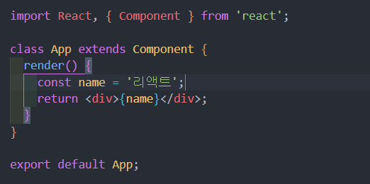
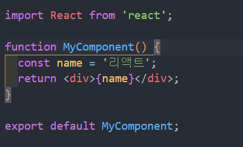
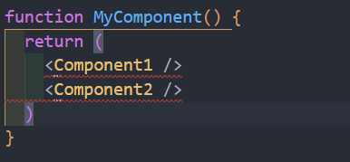
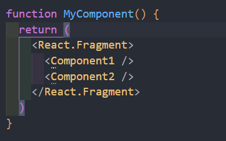

# 컴포넌트 (Component)

## 정의
### 작은 재사용 가능한 조각으로 나눠 독립적으로 동작할 수 있는 단위

## 특징
- #### 컴포넌트는 다양한 기능을 사용을 못하는 단점이 있었음 하지만 Hooks라는 기능이 나오면서 간결하면서 메모리 자원을 덜 쓰는 함수형 컴포넌트를 더 많이 쓰는 추세이다.
- 재사용 가능
- 구조화되고 유지보수 하기 쉬움

## 종류
### 클래스형 컴포넌트

> 
>
> 위에 사진처럼 클래스형 컴포넌트를 사용하려면 React. Component를 상속받아야 됨
>
> render() 영역이 UI를 랜더링 하는 역할을 함
>
> 마지막으로 exprot default ***; 로 정의를 함으로써 다른 Component에서 import를 할 수 있음 
>
> ### 클래스형 컴포넌트의 장점
> - 함수형 컴포넌트에 비해 다양한 기능을 사용할 수 있다는 장점이 있다.

### 함수형 컴포넌트

> 
>
> 확실히 이 짧은 구문에서도 클래스형 컴포넌트보다 간결해진것을 볼 수 있다.
>
> 1. function을 이용해서 함수를 하나 만든다.
> 2. 함수 안에 return()에 HTML을 담는다.
>
> ### 함수형 컴포넌트의 장점
> - 간단한 함수로 정의되므로 코드가 짧고 가독성이 좋다.
> - 클래스형 컴포넌트보다 메모리 자원을 덜 쓴다.
>
> ### 사용할 때 규칙
> 1. Component 이름을 지을 땐 보통 영어 대문자로 시작한다.
> 2. return() 안에 태그들이 여러 개 들어갈 수 없다. 하나의 div나 React.Fragment로 묶어주어야 함!
>
> ### 잘못된 코드
> 
>
> ### 올바른 코드
> 
> 
> ### React.Fragment 
> - JSX에서 시맨틱태그와 같은 component
> - 생략이 가능하므로 <> ... </> 이런 형태로 변경할 수 있음

